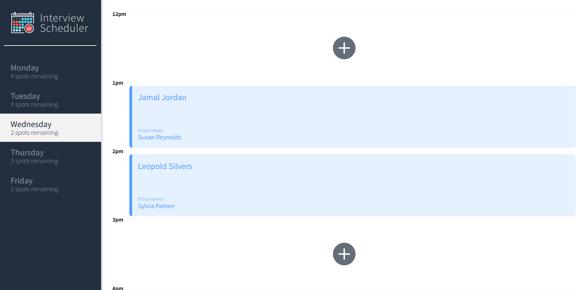
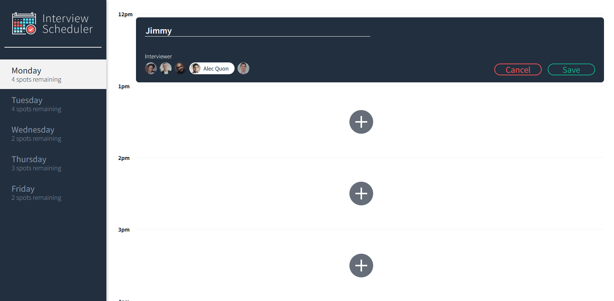
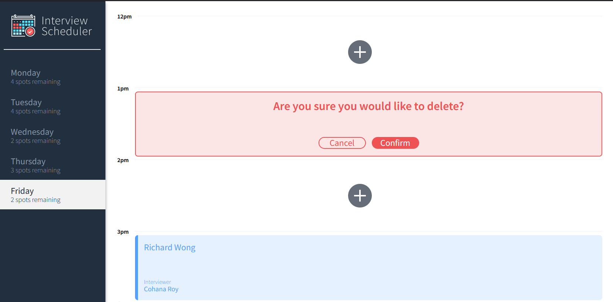

# Interview Scheduler
A single-page React app that connects to an API, and lets users create, edit, and delete appointments in a week in real time. Uses Jest, Storybook, and Cypress to allow for static, unit, and end-to-end testing. 


## Screenshots
Site Homepage


Creating Appointment


Deleting Appointment



## Setup

Install dependencies with `npm install`.

## Running Webpack Development Server

```sh
npm start
```

## Running Jest Test Framework

```sh
npm test
```

## Running Storybook Visual Testbed

```sh
npm run storybook
```
